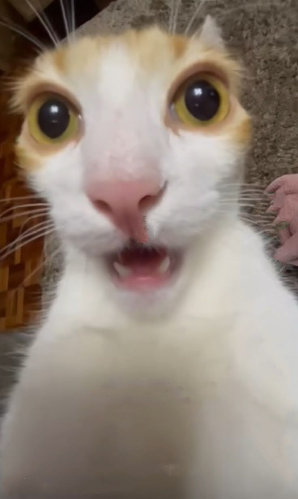
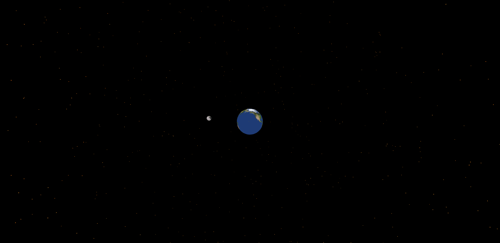
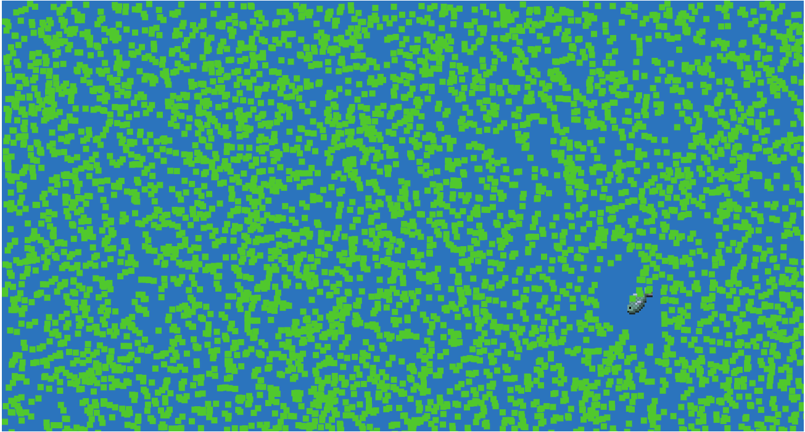
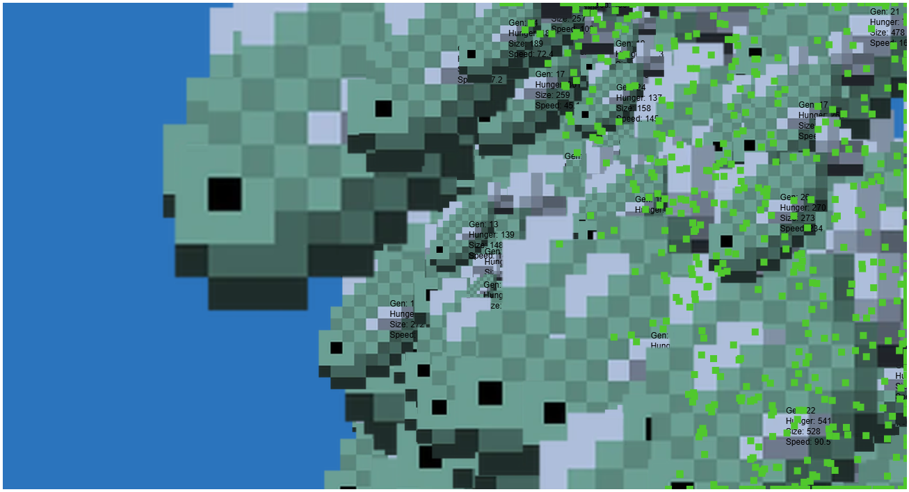
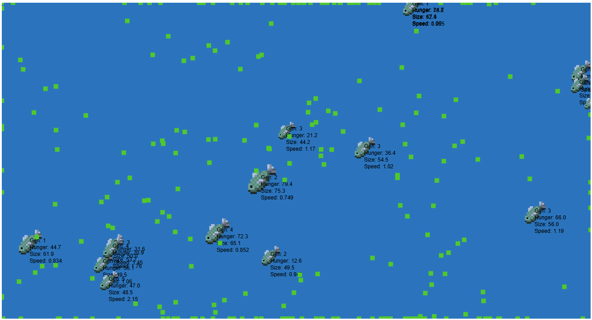

# cart253
> 

## Description

This is a repo containing a collection of short programing projects for my CART 253 course at Concordia University. Each are artistic oddities made primarily in HTML,CSS,JS suite.

## Journal

[Journal](./journal.md)

## Links
### Hello World
[hello_world](./topics/hello_world/index.html)

### Instructions
[Instructions](./topics/instruction-challenge/index.html)

>[Vaporwave](./prototypes/instructions/vaporwave/index.html)

[code](./prototypes/instructions/vaporwave/js/script.js)

>[Sky Full Of Stars](./prototypes/instructions/sky_full_of_stars/index.html)

[code](./prototypes/instructions/sky_full_of_stars/js/script.js)

>[Impending](./prototypes/instructions/impending/index.html)

[code](./prototypes/instructions/impending/js/script.js)

### Variables
[Mr Furious](./topics/variables/index.html) (with Sawyer)

>[Sisyfish](./prototypes/variables/sisyfish/index.html)

[code](./prototypes/variables/sisyfish/js/script.js)

>[Cambrian Explosion](./prototypes/variables/cambrian_explosion/index.html)

[code](./prototypes/variables/cambrian_explosion/js/script.js)

>[Fihmulation](./prototypes/variables/fihmulation/index.html)

[code](./prototypes/variables/fihmulation/js/script.js)

## License

This bit should include the license you want to apply to your work. For example:

> This project is licensed under a Creative Commons Attribution ([CC BY 4.0](https://creativecommons.org/licenses/by/4.0/deed.en)) license with the exception of libraries and other components with their own licenses.