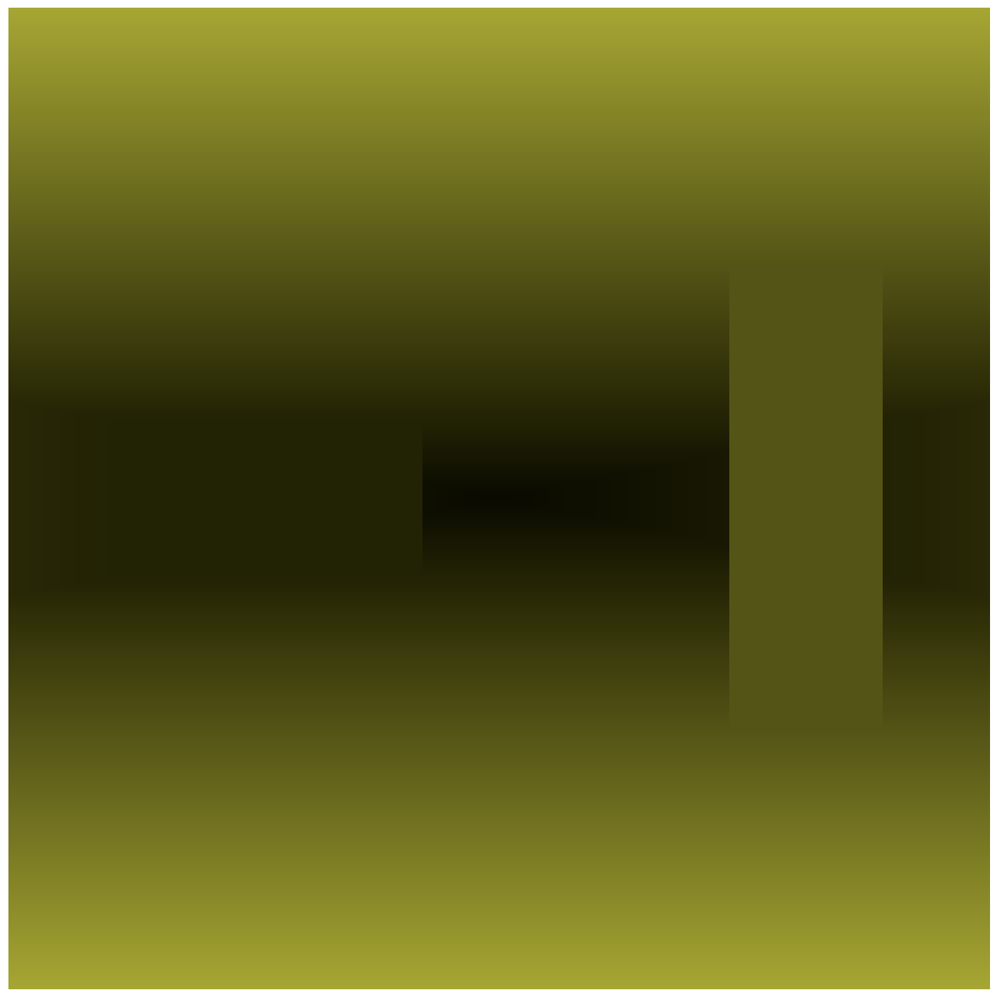
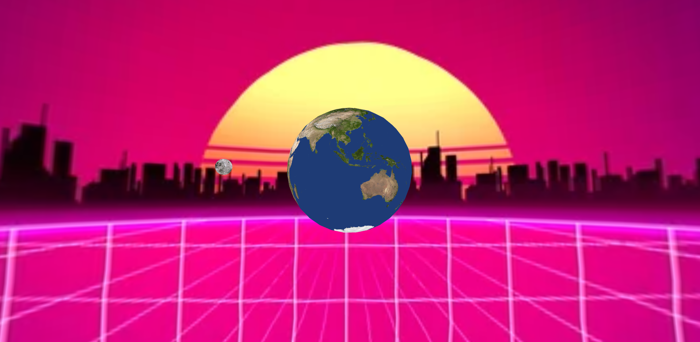
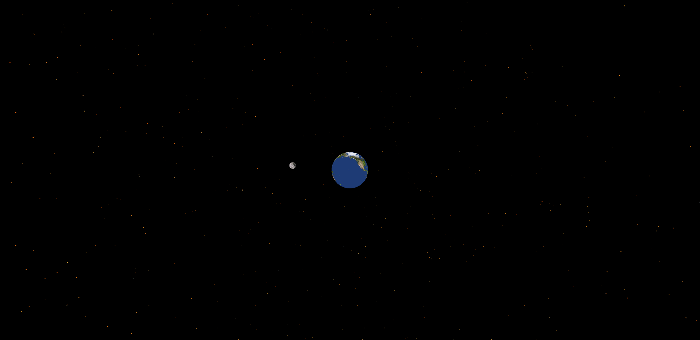
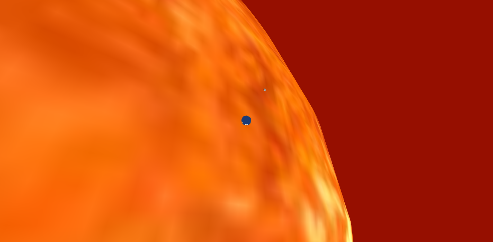

# Reflective Journal

## 2026-08-10
> Im fairly familair with github already, however working on MAC has been a pain for me, but hopefully that will be temporary. For now i editted the sample project to feature the backrooms.
> 
> [Backrooms](./topics/hello_world/index.html)

## 2026-08-22
> After completing the second challenge, I had a working earth and moon orbit model that I wished to take further.
> [Instructions Challenge](./topics/instruction-challenge/index.html)

> My first idea was to create a simple skybox and apply it to the scene.
> 
> This looked alright, but i really wanted distant stars to be visible, and painting a skybox full of them would prove too tedious...
> [Vaporwave](./prototypes/instructions/vaporwave/index.html)

> So, for my second prototype I decided I'd manually place spheres in the sky with a texture of our sun wrapping them. Manually placing them gave me much more control over fine tuning the distance, size, size randomization, amount, etc... to fit my vision.
> 
> I really liked how the complex sun texture made the stars twinkle yellow and orange as I scrolled around the viewport.
> [Sky Full Of Stars](./prototypes/instructions/sky_full_of_stars/index.html)

> Lastly i wanted a piece that captured the truly incomprehansible size of celestial bodies. So, using the sun texture form before, I place a giant sun right next to the earth. I made the model to scale for the most part, with the sun being 109 times larger than the earth.
> 
> Overall, the scene makes our sun appear very imposing, almost like it's about to swallow the earth.
> [Impending](./prototypes/instructions/sky_full_of_stars/index.html)
