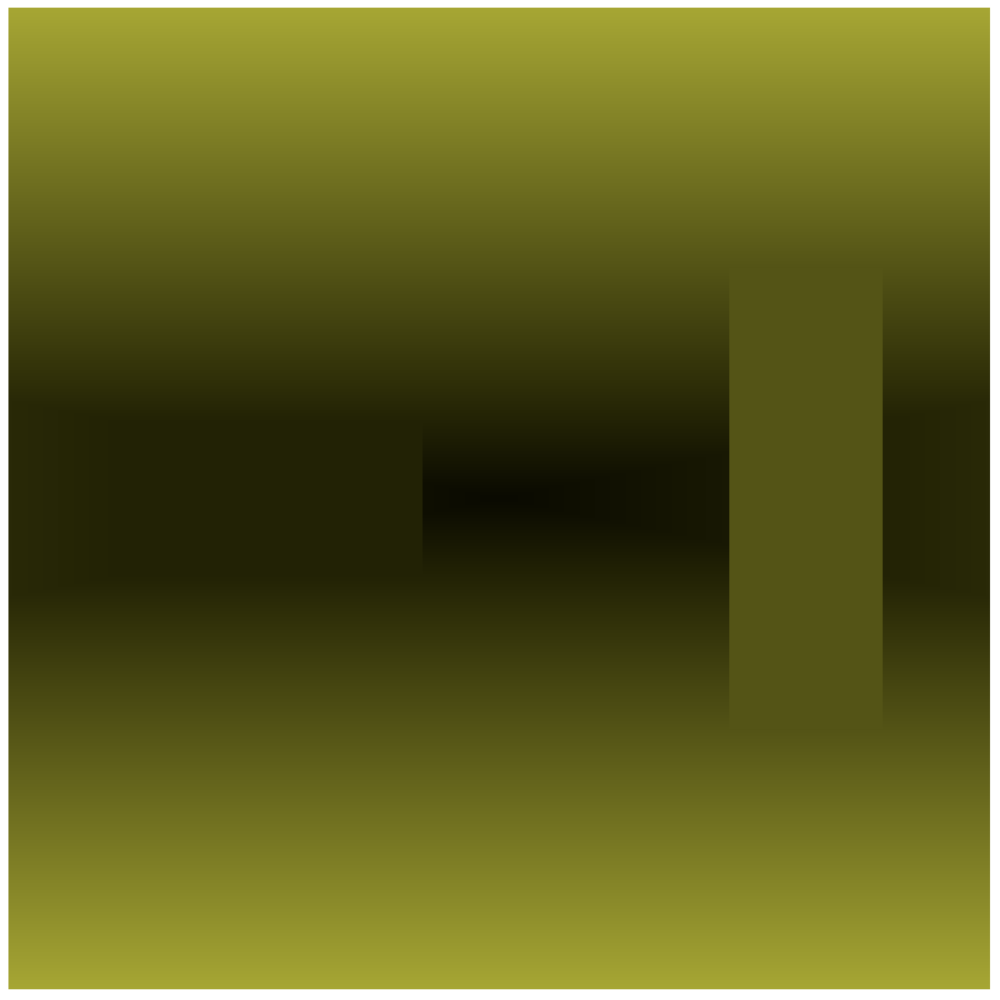
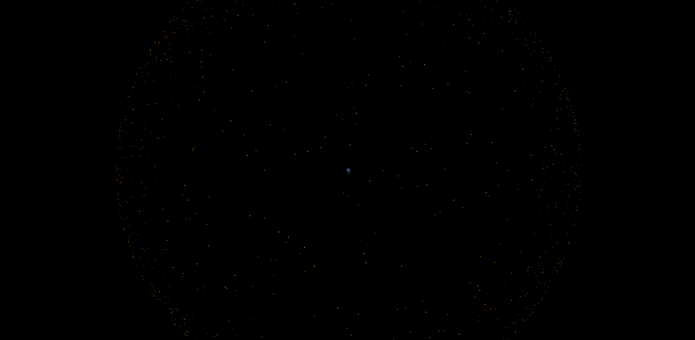
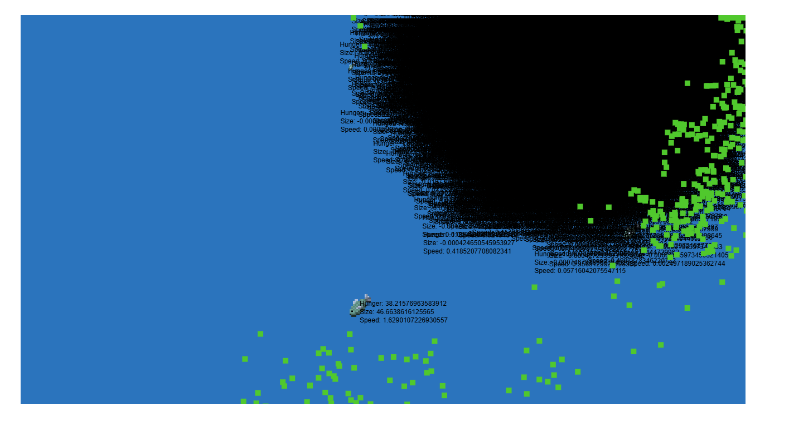

# Reflective Journal

## 2026-08-10
> Im fairly familair with github already, however working on MAC has been a pain for me, but hopefully that will be temporary. For now i editted the sample project to feature the backrooms.
> 
> [Backrooms](./topics/hello_world/index.html)

## 2026-08-22
> After completing the second challenge, I had a working earth and moon orbit model that I wished to take further.
> [Instructions Challenge](./topics/instruction-challenge/index.html)

> My first idea was to create a simple skybox and apply it to the scene.
> 
> This looked alright, but i really wanted distant stars to be visible, and painting a skybox full of them would prove too tedious...
> [Vaporwave](./prototypes/instructions/vaporwave/index.html)

> So, for my second prototype I decided I'd manually place spheres in the sky with a texture of our sun wrapping them. Manually placing them gave me much more control over fine tuning the distance, size, size randomization, amount, etc... to fit my vision.
> 
> I really liked how the complex sun texture made the stars twinkle yellow and orange as I scrolled around the viewport.
> 
> Randomizing the star placement in a sphere around the earth also creates cool effect!
> [Sky Full Of Stars](./prototypes/instructions/sky_full_of_stars/index.html)

> Lastly i wanted a piece that captured the truly incomprehansible size of celestial bodies. So, using the sun texture form before, I place a giant sun right next to the earth. I made the model to scale for the most part, with the sun being 109 times larger than the earth.
> 
> Overall, the scene makes our sun appear very imposing, almost like it's about to swallow the earth.
> [Impending](./prototypes/instructions/impending/index.html)

## 2026-09-27
> Working on the Mr. Furious challenge made me realise the potential p5 holds in making a simulation type of scene. I designed a rudimentary version of what I'd later expand into evolution simulators, with a simple Sisyphean fish that endlessly eats algae for all of eternity. I say its eternal, since in theory each individual algae has a very small chance to duplicate, which can lead to a real eternal ordeal given enough of them on screen.
>[Sisyfish](./prototypes/variables/sisyfish/index.html)
>
> With this basic system allowing objects to be stored in memory and moved around, I decided experimenting with species reproduction by allowing fish to reproduce when they've filled their stomachs. This went horribly wrong for a while, leading to wars between fish and algae populations attempting to overpower the other.
>
> I finally bit the bullet and manually capped the amount of algae that can spawn in a given region. Perhaps I'll implement a more intricate system for flattening algae population at high concentrations later, but this will do for now.
>[Fihmulation](./prototypes/variables/fihmulation/index.html)
>
>After much trial and error, I've created a rudimentary evolution simulator that mimics the process of natural selection by creating competition for limited food resources, as well as allowing fish to reproduce with a chance of random mutations being bestowed to their offspring. The Fihmulation is mesmerizing.
